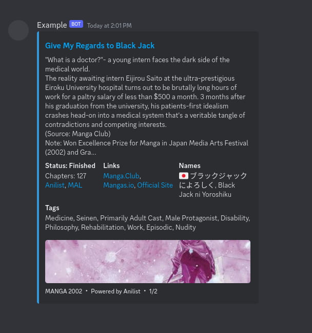
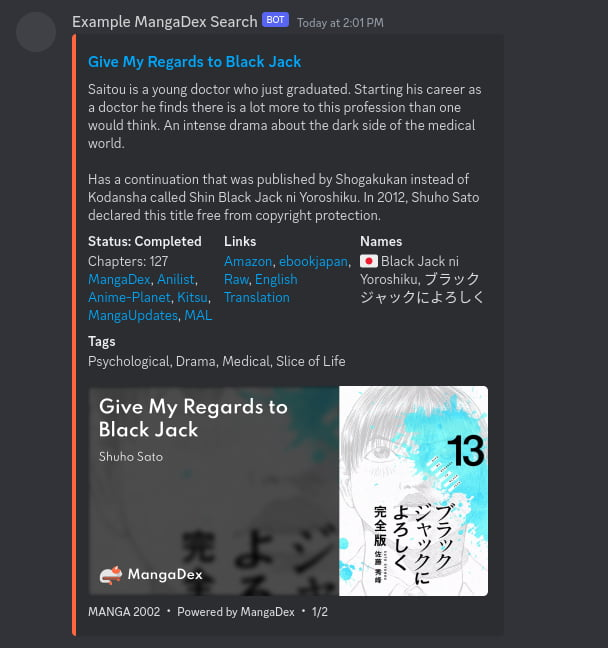

<span class="px-3 py-1 text-xs text-white bg-green-600 rounded-full select-none">#️⃣ Supports Slash Commands</span>

# 🗻 coffeeani

### An open-source anime/manga Discord bot for searching anime, manga, light novels, and anime characters.

The comprehensive Discord bot for searching 漫画 (manga/manhwa/manhua) from Anilist, MangaDex, and Batoto.

| 🔵 | 🟠 |
| --- | --- |
|  |  |


## Features

- Synopsis/summary with official sources, streaming sites, and links
- Series status (Not yet released, Releasing/Ongoing, Finished/Completed)
- Series preview embed images
- Series genre/topic tags
- Anime: Next airing episode
- Media sub-types (Oneshot, Novel, ONA, etc.)
- Media release year
- Media country/language flags
- English language titles with Native language and Romaji/Romanization support

### Anilist

- Search anime
- Search manga (manhwa/manhua and webtoons)
- Search light novels
- Search anime/manga characters
- Search Anilist users

### MangaDex

- Search manga (manhwa/manhua and webtoons)

### Batoto

- Search manga (manhwa/manhua and webtoons)


## About

This cog is a customized fork of **anisearch** by [Jintaku-Cogs-V3 (AGPL-3.0)](https://github.com/Jintaku/Jintaku-Cogs-V3/blob/master/LICENSE) and [Wyn-RedV3Cogs (GPL-3.0)](https://github.com/TheWyn/Wyn-RedV3Cogs/blob/master/anisearch/LICENSE). Thank you for creating anisearch!

This bot is also available on **Matrix** ([Element](https://element.io/personal)) with Maubot at [https://plugins.maubot.xyz](https://plugins.maubot.xyz) as **animemanga** by [coffee-maubot (AGPL-3.0)](https://github.com/coffeebank/coffee-maubot/tree/master/animemanga).

[Coffeeani is open-source (AGPL-3.0).](https://github.com/coffeebank/coffee-cogs/tree/master/coffeeani)
<br /><br />

## Install

### Step 1: Download

Clone or download this project.

### Step 2: Add your Discord Bot info

Copy `.env.example` to `.env`, then:
- Add your bot's token to `dpy_token`
- Add your bot's User ID to `dpy_user_id`

The bot prefix is @ping or Slash command.

### Step 3: Run the Bot

Setup a [venv](https://docs.python.org/3/library/venv.html) using Python >=3.9 and install requirements

```
python3.9 -m venv ~/dpyenv
source ~/dpyenv/bin/activate
pip install -r requirements.txt
```

In the future, you can run your bot anytime using
```
source ~/dpyenv/bin/activate
python3 -m main
```


## Support

[Join the Discord >](https://coffeebank.github.io/discord)
